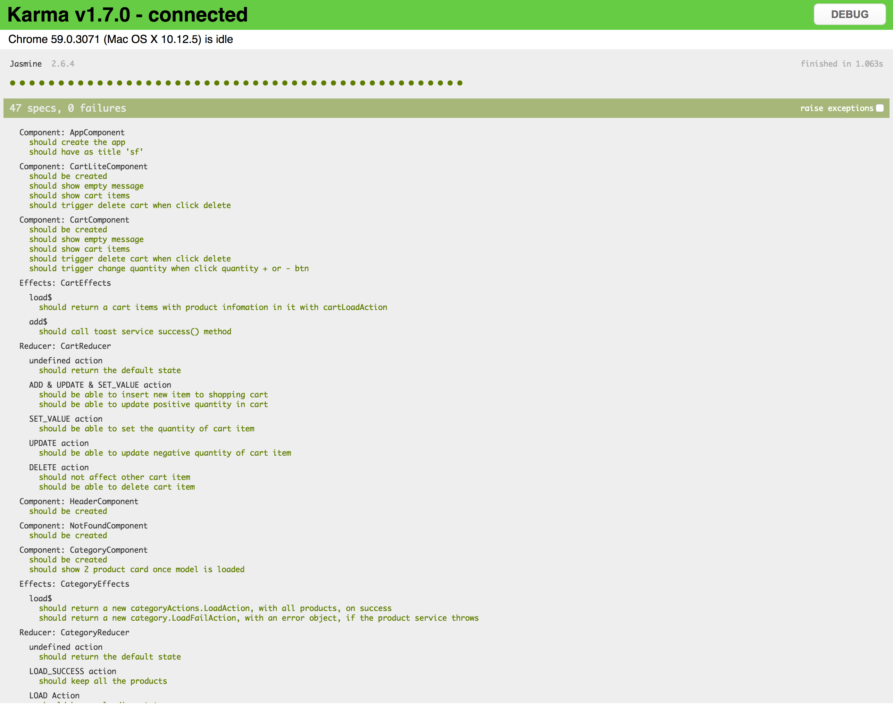
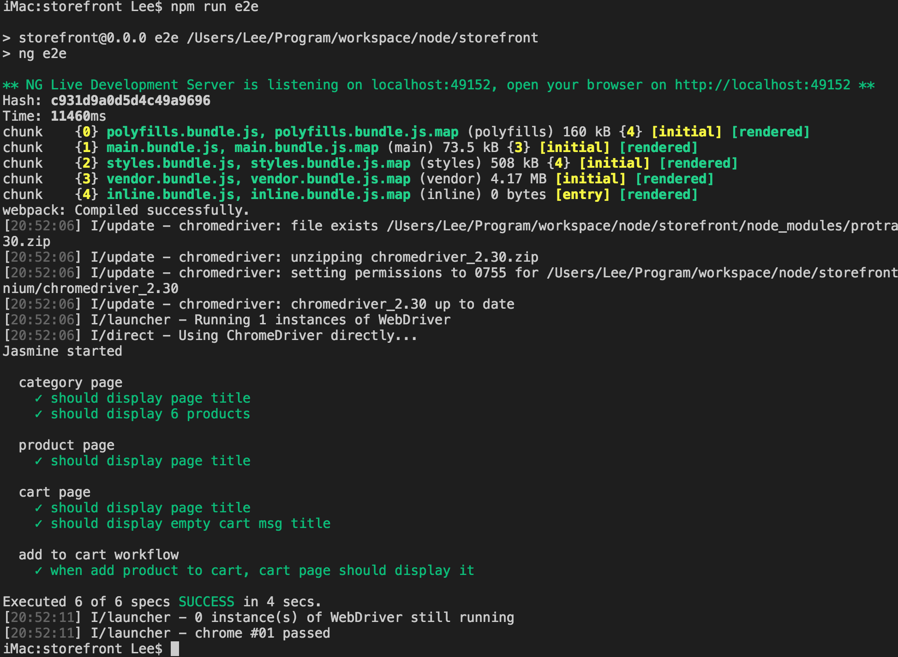
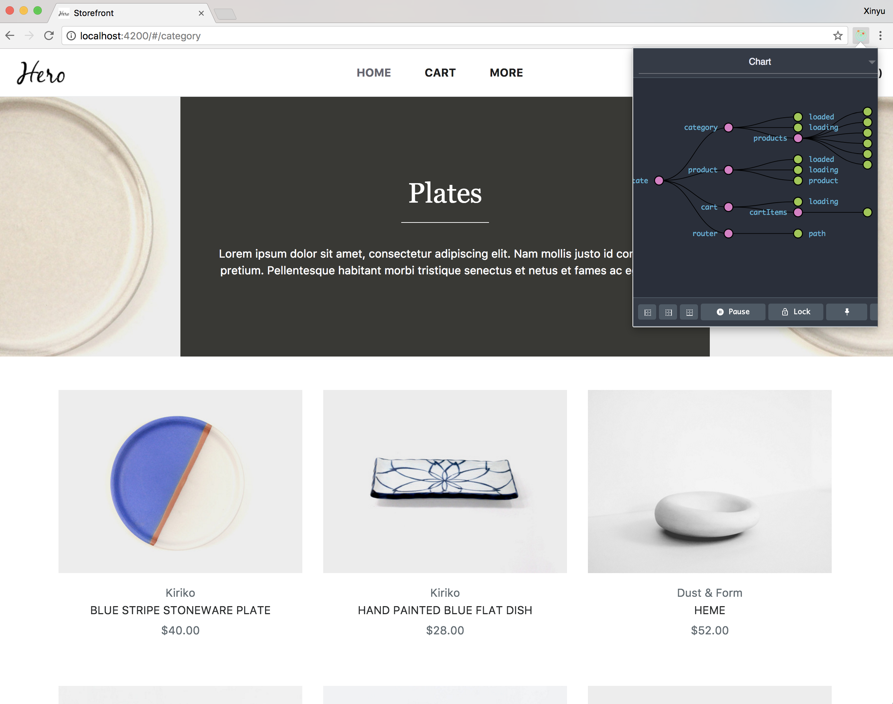

# Storefront

A single page application e-commerce website.

[Live Demo](http://bc.alphacomma.xyz/)

## Development Introduction
### Javascript

* This is an [Angular 4](https://angular.io/) project, the source files are writtern in [TypeScript](https://www.typescriptlang.org/).
* Used [ngrx/store](https://github.com/ngrx/store) to deal with the state management (Angualr 4 version of Redux)
* [npm](https://www.npmjs.com/) is used to maintain the dependencies.

### CSS
* [SCSS](http://sass-lang.com/) is being used as the pre css compiler.
* [Bootstrap 4](https://v4-alpha.getbootstrap.com/) is used as a base framework.
* [Font Awesome](http://fontawesome.io/) is used for the icons
* It's inside the [scss](./src/assets/scss) folder

### Testing

* [Karma](https://karma-runner.github.io/) is used for unit testing
* [Protractor](http://www.protractortest.org/#/) is used for e2e testing

### Deploy

* [Angular CLI](https://github.com/angular/angular-cli) is used to build the project. It's using [Webpack](https://webpack.github.io/)

### Code Architecture

Major components contains the following parts

* Component
* Service
* Reducers
* Actions
* Effects

---

## Installation

    $ git clone https://github.com/fanfan6ji581/storefront.git
    $ cd storefront.git
    $ npm install

### Start & watch

    $ npm start

Run `npm start` for a dev server. Navigate to `http://localhost:4200/`. The app will automatically reload if you change any of the source files.

### Build
    $ npm run build

Run `npm run build` to build the project. The build artifacts will be stored in the `dist/` directory. Use the `-prod` flag for a production build.

### Running unit tests
    $ npm run test

Run `npm run test` to execute the unit tests via [Karma](https://karma-runner.github.io).

* Sample output:

### Running end-to-end tests
    $ npm run e2e

Run `npm run e2e` to execute the end-to-end tests via [Protractor](http://www.protractortest.org/).
Before running the tests make sure you are serving the app via `npm start`.

* Sample output:

---

## Notes

### To Assessor

#### Javascript

* The javscript code is following [Angular Style Guide](https://angular.io/guide/styleguide)
* Unit tests are written for almost all the component/service/reducers/effects. the file names are ending with ".spec.ts".
* Chrome Extension [Redux DevTool](https://chrome.google.com/webstore/detail/redux-devtools/lmhkpmbekcpmknklioeibfkpmmfibljd?hl=en) can be used to check the state and logs of actions fror the system.

#### CSS
* The navbar is built from scratch, as the Bootstrap navbar doesn't fit the requirement.

### Further Improvement

Due to time constraint, there are still some ideas can be future improve the site.

#### Javascript
Here is a list of component that can be further modularized.

* Breadcrumb - This can be extended as a model driven component
* Navbar menus - The navigation menu can be also exteded as a model driven component. 

#### CSS
Can apply more page transition animation, parallax scroll, etc.
